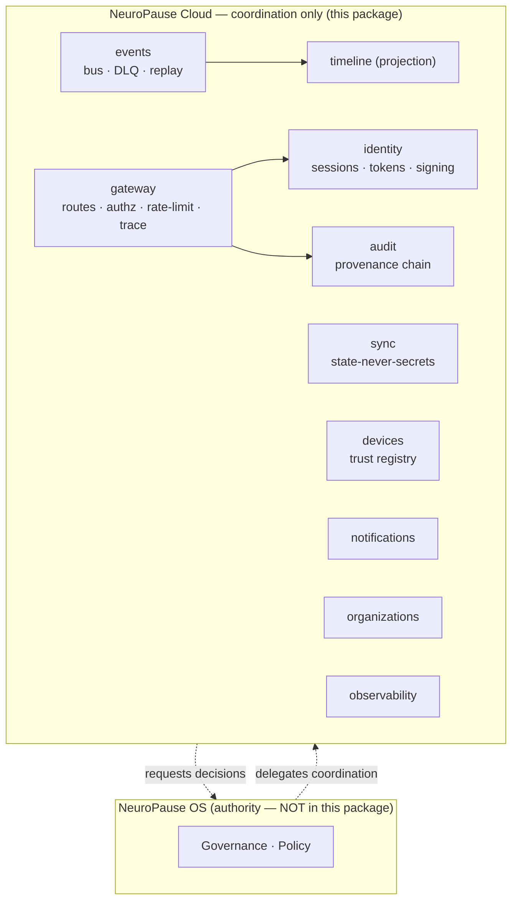

# NeuroPause Cloud Foundation — Implementation Report

**NCEA Phase 10.2 · `@neuropause/cloud@0.0.0-preview.1` · PREVIEW FOUNDATION**

> **Honesty banner.** This is a real, typed, tested foundation built in a single
> implementation session — **not** a deployed, production-ready cloud platform.
> Persistence is in-memory behind interfaces; there is no running server, no
> database, no TLS, no real IdP/push/email, no multi-tenant deployment, no load
> or security validation at scale, and **no customers**. Every "REAL" claim below
> is backed by passing tests; every stub is labeled. See `STATUS.md` for the
> per-module maturity table.

## Executive summary

| Metric | Value |
|---|---|
| Packages added | `apps/cloud`, `packages/shared-cloud`, `packages/cloud-sdk` |
| Source files | 34 (`.ts`, excl. tests) |
| Source LOC | ~1,784 |
| Test files / tests | 12 / **64 passing** |
| Typecheck | `tsc --noEmit` clean (all 3 packages) |
| Lint | `eslint --max-warnings 0` clean |
| Services implemented | events, sync, devices, identity, audit, notifications, organizations, timeline, gateway, observability |

The Cloud Foundation exists as a coherent, composable surface (`createCloud()`),
with the constitution's hardest invariant — *state, never secrets* — enforced at
the **schema layer**, and the event→timeline→audit spine demonstrated by an
integration test.

## 1. Cloud architecture

The cloud is **infrastructure that coordinates**, never the operating system.
`NeuroPause OS` (the desktop runtime) remains the constitutional authority; no
governance decision is made in this package. `src/index.ts#createCloud()` is the
composition root that assembles the services with injected `clock`, `logSink`,
and `secret`, so the whole surface is deterministic under test and free of
hard-coded credentials.



## 2. Service architecture

Each service is a self-contained module behind small interfaces. Status is
**REAL** (working + tested), **FOUNDATION** (real core, missing production
hardening), or noted inline.

| Service | Dir | Status | Core |
|---|---|---|---|
| Event Bus | `services/events` | REAL | routing, ordering, retry, DLQ, replay, versioning |
| Sync | `services/sync` | REAL | schema-enforced secret exclusion, version-vector merge |
| Devices | `services/devices` | REAL | enroll/trust/revoke/health/capabilities |
| Audit | `services/audit` | REAL | deterministic ids, provenance, verification |
| Timeline | `services/timeline` | REAL | event-sourced projection |
| Observability | `services/observability` | REAL | metrics, health, (logger in `lib`) |
| Identity | `services/identity` | FOUNDATION | sessions, token rotation, HMAC API signing |
| Notifications | `services/notifications` | FOUNDATION | channel adapters, history, delivery tracking |
| Organizations | `services/organizations` | FOUNDATION | org/team membership + roles |
| Gateway | `services/gateway` | FOUNDATION | versioned routes, authz, rate limit, trace, audit hook |

## 3. Database architecture

**Today:** every service persists through an in-memory adapter behind a
repository interface (`EventStore`, `SyncStore`, `DeviceRepo`, and the in-service
maps). This keeps the domain logic real and fully testable with zero infra.

**Production follow-up (NOT done):** implement Postgres adapters for those
interfaces (the backend already ships `pg` + migrations, so the pattern exists).
The interfaces are the seam; no domain code changes when the adapter is swapped.
Durable event log + encrypted sync store are the two highest-value adapters.

## 4. API architecture

- **Gateway** (`services/gateway`) is transport-agnostic: `register()` versioned
  routes (`v1`/`v2`), an authorization guard (`public` | `authenticated` + optional
  roles), a token-bucket rate limiter, a per-request **trace id**, and an audit
  hook that reports every allow/deny decision with an HTTP-style status.
- **Envelope**: every response is `ApiResponse<T> { ok, data?, error?, traceId }`
  (`shared-cloud`).
- **SDK** (`packages/cloud-sdk`): a typed `CloudClient` over a pluggable
  `CloudTransport`; ships an `inMemoryTransport` for tests/offline. **Not done:** a
  production HTTP transport (fetch + request signing + retry) and a bound HTTP
  server (Express/Fastify) with TLS termination.

## 5. Event bus architecture

`EventBus` assigns a monotonic `seq`, appends to an `EventStore`, and delivers to
pattern subscribers (`*`, `topic.*`, exact) with bounded retry; exhausted
deliveries go to a **dead-letter queue** and are logged. `replay(fromSeq)`
re-drives persisted events; `EventUpcasterRegistry` chains payload upcasters so
old persisted events stay readable after a schema bump. In-process ordering is
deterministic; distributed partition ordering needs a partitioned durable log
(follow-up).

## 6. Synchronization architecture

The constitution's centerpiece. `syncSchema.ts` validates every envelope and
**rejects any state object containing a secret-like key** (recursively, incl.
arrays) via `SECRET_FIELD_PATTERN` in `shared-cloud`. Result: *state, never
secrets* is a **type error**, not a review convention (the NCEA forward rule).
`SyncEngine` converges multi-device updates with **version vectors** (`vvCompare`
/ `vvMerge`); concurrent updates resolve last-write-wins by `updatedAt` (deviceId
tiebreak) and merge the vector. The syncable **allow-list** and never-sync
**deny-list** are explicit constants.

## 7. Security architecture

**Real + tested:** HMAC-signed access/refresh tokens with **refresh-token
rotation** (a replayed old refresh is rejected); **HMAC request signing** with a
replay window (zero-trust: every request verifiable); **secret redaction** in the
logger; **device trust** as an input to gateway checks; **schema-level secret
exclusion** in sync. Secrets are supplied by the deployment (`createCloud({secret})`),
never hard-coded.

**NOT done (deployment-layer / follow-up):** TLS, real OAuth/OIDC IdP + SCIM,
certificate validation, at-rest encryption, and any penetration or scale security
testing. Token/signature crypto here is real `node:crypto`, but the surrounding
production hardening is explicitly absent.

## 8. Deployment architecture

`DEPLOYMENT_MODES` = standalone · desktop+cloud · private/single/multi-tenant ·
on-prem · air-gapped. **Constitutional guarantee preserved:** every capability is
an in-memory module behind an interface, and nothing here is required for the
desktop to function — **`standalone` / local-first still works with no cloud
reachable.** Multi-tenant isolation and on-prem/air-gapped packaging are design
targets, not implemented.

## 9. Testing strategy & results

- **Unit tests** per service (deterministic via `ManualClock`); **integration
  test** (`src/integration.test.ts`) exercises authz → event → timeline → audit
  and the end-to-end secret-rejection.
- **Real results:** `64 passing` across `12` files; `tsc --noEmit` clean; `eslint
  --max-warnings 0` clean. (Run: `cd apps/cloud && npx vitest run`.)
- **NOT covered (honest gaps):** load/performance, security/pen testing,
  contract tests against a real HTTP server, and integration against real
  Postgres/Redis. Those require the production adapters + a running environment.

## 10. Risk analysis

| Risk | Severity | Note |
|---|---|---|
| **Sequencing** — 10.2 built before the 10.1 desktop signing/certification/pilot gate | High | Per NCEA this inverts risk; this scaffold is design-ahead only and commits nothing to premature deployment. |
| In-memory persistence mistaken for durable | Med | Labeled everywhere; adapters are the seam. |
| Duplication with `apps/backend` (auth/devices/sync already exist there) | Med | Migration plan §11 addresses consolidation; do not run two authorities. |
| Distributed ordering assumed from in-process bus | Med | Needs a partitioned durable log before multi-node. |
| Secret leakage via sync | Low (mitigated) | Schema-enforced rejection + tests close the highest-severity path. |

## 11. Migration plan

1. **Wire into the workspace:** `apps/cloud` + the two packages are `apps/*` /
   `packages/*` members; `npm install` links them (this session symlinked them
   manually for the test run). Add `typecheck`/`test` to CI matrix.
2. **Reconcile with `apps/backend`:** the backend already has real `auth`,
   `devices`, `sync`, `organizations`. Decide one home per capability — treat this
   package as the *coordination/API* layer and the backend as the *service* layer,
   or fold the backend's modules behind these interfaces. **Do not ship two
   sources of truth.**
3. **Swap adapters:** implement Postgres `EventStore`/`SyncStore`/`DeviceRepo`;
   add a real HTTP transport to `cloud-sdk` and a bound server to the gateway.
4. **Backward compatibility:** desktop `standalone` is unaffected — the cloud is
   additive and optional by construction.

## 12. Repository changes

```
apps/cloud/                      # @neuropause/cloud (new)
  STATUS.md  IMPLEMENTATION-REPORT.md  CONSTITUTIONAL-COMPLIANCE.md
  package.json  tsconfig.json  vitest.config.ts
  src/index.ts  src/integration.test.ts
  src/lib/{result,clock,ids,logger,index}.ts
  src/services/{events,sync,devices,identity,audit,
                notifications,organizations,timeline,gateway,observability}/
packages/shared-cloud/           # @neuropause/shared-cloud (new) — DTOs + constitutional constants
packages/cloud-sdk/              # @neuropause/cloud-sdk (new) — typed client
```

No existing files were modified.

## 13. Architecture diagram

See §1. Per-flow: `gateway.handle()` authorizes → a handler `events.publish()` →
`TimelineProjection` projects → `AuditChain.append()` records verifiable
provenance. Demonstrated in `src/integration.test.ts`.

## 14. This report

Deliverables 1–13 above; constitutional compliance is `CONSTITUTIONAL-COMPLIANCE.md` (§15).

---
*Generated for NCEA Phase 10.2. Preview foundation — do not represent as certified or production-ready.*
