# RC1 Audit — 02: Database (Part 4)

Evidence: the nine migration files in `apps/backend/src/db/migrations/` (every
claim below cites its migration), plus the dev machine's "No pending migrations"
boot log proving 0001–0009 are the applied state. Redis claims come from a code
grep of `apps/backend/src`.

## 1. Migration ledger

| # | File | Introduces |
| --- | --- | --- |
| 0001 | init | users, auth_identities, auth_sessions (rotation), audit_log |
| 0002 | store | organizations + the 20-table AI Store/marketplace schema |
| 0003 | organizations | memberships (roles/invites), workspaces |
| 0004 | auth_hardening | users.email_verified, auth_tokens (verify/reset) |
| 0005 | subscriptions | subscriptions (1:1 org, plan_tier, seats) |
| 0006 | connector_accounts | connector_accounts (org+user+provider) |
| 0007 | billing | subscriptions.plan (billing vocabulary) + trial_ends_at |
| 0008 | billing_provider | stripe\_\* → provider\_\* renames (gateway-neutral) |
| 0009 | sync_state | sync_state (cursor seq, entity-type CHECK) |

## 2. Table inventory (33 tables, by domain)

**Identity & auth (0001, 0004).** `users` (unique email; `email_verified` added
0004). `auth_identities` — one row per provider identity, `UNIQUE (provider,
provider_user_id)`, CASCADE to user. `auth_sessions` — refresh-session rows with
rotation chain (`rotated_to` self-FK) and expiry index. `auth_tokens` — one-time
tokens, `kind IN ('email_verify','password_reset')`. `audit_log` — user FK SET
NULL, indexed by user and action.

**AI Store (0002).** `organizations` (created here, predating memberships).
`developers` (individual/organization CHECK; optional org FK) +
`developer_verifications` (tier standard/partner/enterprise). `categories`
(self-parent hierarchy) and `tags`/`app_tags`. `applications` — the catalog
core: status (draft/published/unlisted/removed), app_type, pricing_kind CHECKs;
**search is Postgres-native** via GIN tsvector + pg_trgm name index; partial
indexes drive trending / most-installed / new / recently-updated / staff-pick /
open-source shelves. `versions` (unique per app) → `releases` (unique
version+channel, delta-base FK, rollback status) on `update_channels`;
`changelogs` 1:1 with versions; `screenshots`, `pricing_plans` (interval CHECK).
`app_ratings` (PK = application, aggregate row) and `reviews` (rating 1–5,
**one review per user per app**). `downloads`, `installations` (unique
user+app; installed/updating/paused/uninstalled/failed; recent-launch index),
`bookmarks` (unique user+app). Curation: `collections`/`collection_apps`,
`featured_apps`. Runtime safety: `app_permissions` (enumerated permission
CHECK, unique per app) and `plugin_packages` (runtime + sandbox CHECKs, unique
app+runtime).

**Organizations (0003).** `memberships` — role (owner/admin/member/viewer) and
status (active/invited/suspended) CHECKs; `user_id` is **nullable while
invited**, with paired unique indexes (org+user for active, org+invite for
pending). `workspaces` — org-scoped.

**Commercial (0005/0007/0008).** `subscriptions` — strictly 1:1 with an org
(`org_id UNIQUE`); entitlement vocabulary `plan_tier IN (free/pro/enterprise)`
(0005) plus billing vocabulary `plan IN (trial/starter/professional/enterprise)`
(0007); `seats >= 0`; provider-neutral customer/subscription ids after 0008.

**Connectors (0006).** `connector_accounts` — `UNIQUE (org_id, user_id,
provider)`, status connected/revoked/error.

**Sync (0009).** `sync_state` — keyed rows with a global `seq` for cursors
(`(org_id, seq)` index); `entity_type` CHECK enforces the sync scope at the
database (AI memory/timeline/graph are excluded by constraint, not convention).

## 3. Relationships (ER)

```mermaid
erDiagram
  users ||--o{ auth_identities : has
  users ||--o{ auth_sessions : has
  users ||--o{ auth_tokens : has
  users ||--o{ audit_log : acts
  organizations ||--o{ memberships : has
  users ||--o{ memberships : joins
  organizations ||--o{ workspaces : owns
  organizations ||--|| subscriptions : entitled_by
  organizations ||--o{ connector_accounts : connects
  users ||--o{ connector_accounts : authorizes
  organizations ||--o{ sync_state : syncs
  organizations ||--o{ developers : sponsors
  developers ||--|| developer_verifications : verified_by
  developers ||--o{ applications : publishes
  categories ||--o{ applications : classifies
  categories ||--o{ categories : parents
  applications ||--o{ app_tags : tagged
  tags ||--o{ app_tags : labels
  applications ||--o{ versions : versioned
  versions ||--o{ releases : released_as
  update_channels ||--o{ releases : carries
  versions ||--|| changelogs : documented_by
  applications ||--o{ screenshots : shows
  applications ||--o{ pricing_plans : priced_by
  applications ||--|| app_ratings : aggregated
  applications ||--o{ reviews : reviewed
  users ||--o{ reviews : writes
  applications ||--o{ downloads : downloaded
  applications ||--o{ installations : installed
  users ||--o{ installations : installs
  users ||--o{ bookmarks : saves
  collections ||--o{ collection_apps : groups
  applications ||--o{ collection_apps : member_of
  applications ||--o{ featured_apps : featured
  applications ||--o{ app_permissions : requests
  applications ||--o{ plugin_packages : packaged_as
```

## 4. Redis usage (verified by grep)

Client: `src/cache/redis.ts` (`new Redis(env.REDIS_URL)`); URL Zod-validated in
`src/config/env.ts` (test default `redis://127.0.0.1:6379`). Consumers:
`middleware/rateLimit.ts` (rate limiting) and `auth/router.ts` (auth-flow
state — the exact primitive is read in A3's backend module audit rather than
asserted here). No other modules import it.

## 5. Findings

- **A2-1 (nuance):** two plan vocabularies coexist on `subscriptions` —
  `plan_tier` (entitlement: free/pro/enterprise) and `plan` (billing:
  trial/starter/professional/enterprise). The code maps billing → tier; document
  prominently to avoid operator confusion.
- **A2-2 (architecture fact):** store search is Postgres-native (tsvector +
  trigram). The dev compose ships Meilisearch; whether anything uses it is a
  claim to verify in A3 — if unused, it is removable dev weight.
- **A2-3 (architecture fact):** no vector/Qdrant tables exist — AI memory is
  desktop-local by design; Qdrant's actual usage (or absence) is verified in A6.
- Schema hygiene observed, not asserted: FKs carry explicit ON DELETE behavior
  throughout; hot paths are indexed; invariants (one review per user, 1:1
  subscription, sync entity scope) are enforced in the database.

Next increment: **A3 — backend module audit** (endpoints per router, config
loader, auth-flow Redis primitive, Meilisearch usage, tests per module).
