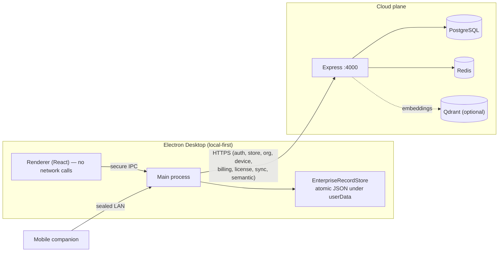
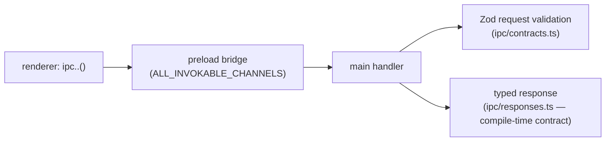

# NeuroPause — Developer Guide

> **NeuroPause Global Product RC** · Documentation v1.0 · Product build `1.0.0-rc.15` (`0a040e2`) · Last updated 2026-08-08 · Audience: developers
>
> Technical audience — architecture terms used directly. Everything here reflects the actual repository at the baseline commit.

## Monorepo layout

npm-workspaces TypeScript monorepo, Node ≥ 20 (Electron targets 22).

- `apps/desktop` — Electron app (main process, preload bridge, React/Vite renderer). Imports only `@neuropause/shared`.
- `apps/backend` — Express + PostgreSQL + Redis cloud plane (auth, store, org, devices, billing, license, sync, semantic, observability).
- `apps/cloud` — cloud libraries. `apps/mobile` — Expo companion app (standalone, outside the root workspaces + release gate).
- `packages/*` — ~46 shared packages (`shared`, `companion-protocol`, `cloud-core`, `shared-cloud`, `industry`, `solution-packs`, `sdk`, `connectors`, `workforce`, …).

## The core architectural truth: local-first + a thin cloud plane



Key invariants:
- The **renderer makes no network calls** — all data access is main-process IPC.
- **Enterprise/ERP/knowledge/workforce/memory data is local-first** (atomic JSON via `EnterpriseRecordStore`; a single `storePaths` registry enumerates every durable store and drives backup coverage).
- The desktop **main process** is the only thing that calls the backend (11 typed HTTP clients), always with a bearer token.
- The **mobile companion** is served by the desktop's own sealed LAN gateway (view-models only) — not by the backend.

## IPC contract (the secure bridge)



- Requests validated at runtime by Zod (`ipc/contracts.ts`); responses validated at **compile time** by `IpcResponseMap` (a missing entry is a typecheck error).
- Adding an invokable channel: declare it in `RUNTIME_INVOKABLE_CHANNELS`, add the response type, classify authz, add the Zod schema. Generic enterprise modules are dynamically authorized (scope in the descriptor) — no per-channel wiring.
- Persistence: every durable store is declared once in `main/storage/storeSchemaRegistry.ts` and persists through a versioned envelope (schema stamp, ordered upgrades, read-only-on-newer, quarantine sidecar).

## Backend (cloud plane)

Express app (`apps/backend/src/app.ts`) with helmet, CORS, request-id, pino-http, rate-limiting, Zod validation, and an error handler. Routes: `/auth`, `/store`, `/organizations`, `/devices`, `/billing`, `/license`, `/sync`, `/memory/semantic`, `/health`, `/live`, `/metrics`. Postgres via `pg` (12 migrations, `src/db/migrate.ts`); Redis via `ioredis`; JWT via `jose`/`jsonwebtoken`; argon2 passwords. See [API/SDK Guide](API-SDK-GUIDE.md) and `claude/PHASE-3-BACKEND-ARCHITECTURE.md`.

## Development setup

```bash
npm install                     # root; installs workspaces (apps/mobile is separate)
npm run infra:up                # docker compose: postgres:16 + redis:7 (+ qdrant reserved)
# copy .env.example → .env (root) and apps/backend/.env; set JWT_ACCESS_SECRET
npm run db:migrate              # apply the 12 migrations
npm run dev                     # runs backend + desktop together
```

Desktop-only: `npm run dev -w @neuropause/desktop`. Backend-only: `npm run dev -w @neuropause/backend`.

## Testing

- **Release gate (infra-free):** `npm run typecheck:release && npm run lint:release && npm run test:release` — the enforced gate over shared/companion-protocol/cloud-core/shared-cloud/backend/desktop. Baseline: **631 test files / 5,703 tests**.
- **Backend integration (real DB):** `npm run test:integration -w @neuropause/backend` with `TEST_DATABASE_URL` + `REDIS_URL`. It **auto-creates** the test database and applies migrations. Lives in `apps/backend/src/__integration__/` (excluded from the default run).
- Desktop renderer tests are **Node-only** (no jsdom/RTL) — pure view-model/logic only; UI is verified by manual QA.
- `apps/mobile` and `packages/sdk` have their own runners (outside the release gate).

Rules: never weaken or skip a test to go green; `eslint --max-warnings 0` is enforced (Prettier is not the gate).

## Build & release

- Package the desktop: `npm run package:mac` (Apple Silicon) → electron-builder; `verify:release` checks artifacts. A **signed & notarized** artifact needs a signing identity (operator action).
- Backend build: `npm run build -w @neuropause/backend` (tsup) → `node dist/index.js`.

## Debugging

- Event Inspector + diagnostics are **DEV-gated** (`import.meta.env.DEV`) and hidden from packaged pilot builds.
- Backend logs are structured (pino) with request ids; never log secrets/tokens.
- Health at `/health` (readiness) vs `/live` (liveness); `/metrics` for Prometheus.

## Related
[API/SDK Guide](API-SDK-GUIDE.md) · [Admin Guide](../admin/ADMIN-GUIDE.md) · `claude/PHASE-3-*` certification docs
