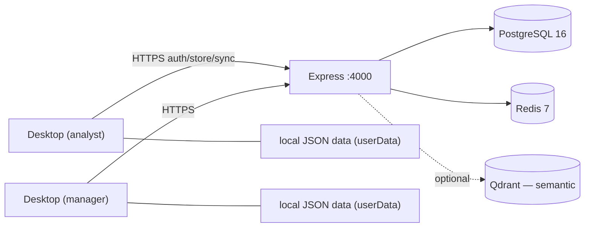

# NeuroPause — Enterprise Pilot Guide

> **NeuroPause Global Product RC** · Documentation v1.0 · Product build `1.0.0-rc.15` (`0a040e2`) · Last updated 2026-08-08 · Audience: enterprise evaluators, IT, pilot leads
>
> A repeatable pilot. Maturity: **Release Candidate** — pilot-ready, not general-availability. Tags: **Local-first**, **Cloud**, **External dependency**, **Preview**, **Known limitation**.

## 1. Pilot objectives

Prove NeuroPause works as one coherent enterprise operating system for your team: sign in, navigate, run representative business + AI + knowledge + operations workflows on **your** data, and confirm the local-first / cloud-plane split behaves as documented. This is a *functional* pilot, not a load test.

## 2. The two planes (set expectations first)

- **Local-first plane** — all ERP/enterprise/knowledge/workforce/memory data lives **on each device** (atomic JSON under the user-data dir). No cloud database holds your business records.
- **Cloud plane** — the Express + PostgreSQL + Redis backend provides **auth, AI Store, organizations, devices, billing, licensing, sync, and semantic-search infrastructure**.

## 3. Prerequisites

- **Desktop:** macOS (Apple Silicon) is the first target. Run from source for a pilot, or a packaged build (a signed/notarized artifact is **not yet published** — see [Download Catalog](../downloads/DOWNLOAD-CATALOG.md)).
- **Backend host:** Node ≥ 20, Docker (for `infra:up`) or a reachable PostgreSQL 16 + Redis 7.
- **Network:** desktops must reach the backend URL (`PUBLIC_BACKEND_URL`, default `:4000`).

## 4. Deployment architecture



Each desktop keeps its own local data; the backend is shared and central. Cross-device **sync** (opt-in) reconciles local stores through `/sync`.

## 5. Stand up the backend (verified path)

```bash
npm install
npm run infra:up          # postgres:16 + redis:7 (+ qdrant reserved)
# create .env (root) and apps/backend/.env from .env.example; set a strong JWT_ACCESS_SECRET
npm run db:migrate        # 12 migrations
npm run dev               # backend + desktop
```

Verify: `GET /health` → `{"status":"ok","components":{"database":"up","redis":"up"}}`. (Phase 3 certified auth, tenancy, authorization, store, health, and failure/recovery against a real Postgres+Redis.)

## 6. Dependencies & what they gate

| Dependency | Enables | If absent |
|---|---|---|
| PostgreSQL + Redis | sign-in, org, store, sync | **backend won't serve auth** → users can't sign in |
| **OAuth providers** (Google/GitHub/MS/Apple) | social sign-in | email/password still works; social buttons hidden (**External dependency**) |
| **AI provider** (Anthropic key or Ollama) | live AI (Workforce, Assistant, AI automations) | deterministic fallback; no fake results (**External dependency**) |
| **Qdrant + embeddings** | semantic search ranking | local lexical search only (**External dependency**) |
| **Connector OAuth apps** | real connections | connectors listed but not connectable (**External dependency**) |
| **Razorpay keys** | billing | billing disabled (**External dependency**) |

## 7. Security checklist (before real data)

- Set a strong `JWT_ACCESS_SECRET`; never commit `.env`.
- **Rotate** any provider secrets ever placed in dotfiles (`.env.entra`, `.env.github`); move to secret management; verify they were never committed; revoke old ones.
- Confirm keychain encryption is available on each desktop (refresh tokens are stored encrypted).
- Review roles/permissions and HR privacy gating.
- See [Data & Security Guide](DATA-AND-SECURITY-GUIDE.md). *(No SOC 2 / ISO / HIPAA / GDPR certification is claimed.)*

## 8. Tenant, users, roles

1. Create your **organization**; invite pilot users (email/password to start).
2. Assign roles (owner/admin/member/viewer); tenant isolation is DB-enforced (verified).
3. Create **workspaces** as needed. HR read/manage is restricted to Manager/Admin.

## 9. Suggested pilot workflows (progressive)

Aligned with the product's progressive-disclosure model — don't open all 40 surfaces on day one:

1. **Start** → Today / Work Hub.
2. **Operate** → Business: pick 1–2 families you use (e.g. Finance, CRM), create/read/update real records, confirm persistence.
3. **Intelligence** → Knowledge: search + AI Memory.
4. **AI** → AI Workforce: a governed action end-to-end (needs AI provider) — observe approval + evidence.
5. **Control** → Operations: health/incidents.
6. **Extend** → AI Store / Connectors: install an app; connect one real integration.
7. **(Vertical)** → Industry Center: select the one pack for your vertical (Preview).

## 10. Acceptance criteria

- Users sign in and reach the shell; navigation is understandable without docs.
- Representative Business records persist and reload correctly.
- A governed AI action runs (with a provider) and leaves evidence — or fails honestly without one.
- Operations shows real health (no false "Live"); failure states are honest.
- Local-first vs cloud behavior matches this guide.

## 11. Known limitations (pilot-relevant)

- **Cold-launch auth needs the backend** — an outage strands users on the login screen despite local data.
- **Desktop GUI verification** (visual QA) is a human task — see `claude/PHASE-2-UX-QA.md`.
- Preview surfaces (Enterprise Knowledge, Digital Twin, Autonomous Operations, Industry, Enterprise Marketplace, Cloud, Federation, …) run on seeded/in-memory data.
- No public HTTP Enterprise API.

## 12. Support & exit

Log issues with the classification the team uses (BUG / MISSING / BACKEND DEP / EXTERNAL DEP / CONFIG / KNOWN LIMITATION). **Exit criteria:** acceptance criteria met, dependencies understood, a go/no-go decision with a documented list of what to configure for production (providers, signing, secret management, backend hosting).

## Related
[Data & Security Guide](DATA-AND-SECURITY-GUIDE.md) · [Trial Experience](../product/TRIAL-EXPERIENCE.md) · [Demo Script](DEMO-SCRIPT.md) · [Admin Guide](../admin/ADMIN-GUIDE.md)
